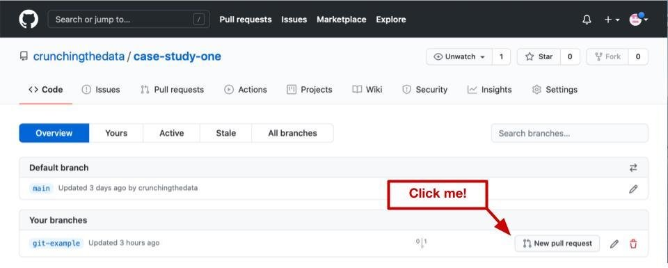

# Creating a GitHub repository

Setting up a new repository to version control your code is one of the first steps you should take when starting a new data science project.

For the purposes of this project, git will be used to version control our code and GitHub to host an online version of the git repository.

## What is version control?

Version control software is software that keeps track of changes that are made to your code by taking snapshots of your code at different points in time. These snapshots serve as checkpoints which you can revert to with the click of a button if you introduce a bug into your code or find out that the updates you just made were not necessary

Many types of version control software also allow you to maintain separate branches or versions of your code that you can easily navigate back and forth between. This is useful if you want to make changes to your code for an ad hoc analysis but also want to maintain a separate version of your code without the charges.


## Why use version control for data science?

Here are some of the most common reasons to use version control for data science projects.

* **Easy rollbacks**. Version control software allows you to easily roll back to previous versions of your code if you make a mistake.

* **Automatic change log**. Version control software allows you to track which updates were made to your code at which checkpoints.

* **Reduce redundancy**. Version control software eliminates the need to store redundant copies of the same code in the same directory by allowing you to maintain different versions of your code on different branches.

* **Enable collaboration**. Version control makes it easy to work on the code on the same time as your colleagues then merge the changes back together at a later date.

* **Boost your resume**. If nothing else, being familiar with a common version control software such as git is a great resume booster.

# Setting up for a GitHub repository

In this article, I will assume that you have a GitHub account and that you know how to create and clone a repository to your local computer. 

# Creating your first branch

Now that you have a local git repository up and running, you can practice making changes to your code and pushing them back to your remote git repository.

We will work through an example of a basic git workflow.


## 1. Pull changes from remote main

Start out by making sure you're in your main branch by using the command `git branch`. Using this command will print a list of available branches and the one you're on will have an asterisk next to it.

```
git branch
```

After making sure you're on the correct branch, use the pull command to make sure that your branch is up-to-date with the main branch in the remote repository.

```
git pull
```

## 2. Branch of a local main

Now that your main branch is up-to-date, you can create a new branch. The easiest way to do this is to create a new branch and automatically navigate to that branch using the `checkout` command with the flag `-b`. We will call our branch `git-example`.

```
git checkout -b git-example
```

## 3. Work on your branch

Now that you are on your new branch, it's time to make changes to your files. To keep this simple, make a small change to your README file and save the changes.

The next step is to use the `add` command to add your changes to the **staging** area.

```
git add README.md
```

After you add your updated README file to the staging area, you can take a snapshot of your updated branch using the `commit` command. Use `-m` flag to add a message for your commit.

```
git commit -m 'add a simple sentence to readme'
```

## 4. Push to remote

Now you can push changes you made on your local `git-example` branch to the remote repository using the `push` command. You can use the `-set-upstream` option *to let git know that your local branch should track a similarly named branch in the remote repository*. You can use the word `origin` *to refer to the remote GitHub repository because that is the original repository that your local repository was clones from*.

```
git push --set-upstream origin git-example
```

## 5. Merge into remote main

Now you have an updated version of your git-example branch in your remote GitHub repository. The next step is to merge the branch you have been working on back into your main branch by creating a **merge request**(also known as **pull request**) using the GitHub web interface.

Navigate to your remote repository. If you just recently pushed code to a branch then you may see a button asking if you want to create a push request. This is the easiest way to create a pull request. If you do not see this button, then you can click into the branches tab to see a list of all the branches in your remote repository.


If you click into the branches tab, you should see a list of branches. Click on the button next to your git-example branch.



After you click the button, you will be asked to add a title and description to the pull request. Fill these fields out and make sure that the correct branches are being merged then click the create pull request button. Then you can use the merge pull request button on the next screen to merge the branch you were working on into your main branch.

# Summary

In this article, we covered a gentle introduction to git and GitHub, pointing out how to work with branches, how to commit changes, how to push changes to the remote repository, how to create pull requests and how to merge changes.

We will apply these concepts throughout the project.

## Next Steps

1. Creating a GitHub Repository
2. **Setting up a Conda environment**
3. Checking data quality
4. Creating a python package
5. Unit tests for data science
6. Object oriented programming in python
7. Tracking data with MLflow
8. Tracking models with MLflow
9. Serving models with Flask