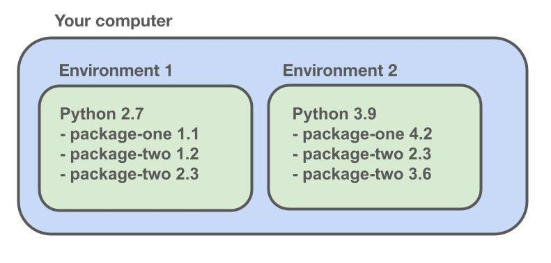
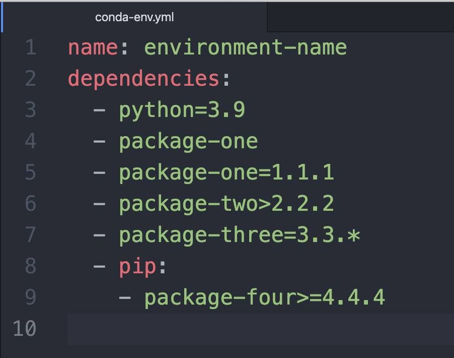
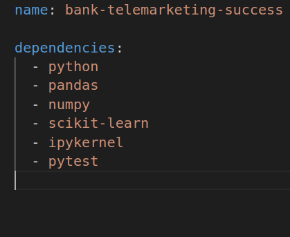

# Setting up a Conda environment

Previously we set up a git repository to version control our code. Now we will set up a package manager to manage our Python environment. This will give us control over the package versions we use and allow us to containerize our production.

We will use Conda environments because they are language agnostic and beginner-friendly. 



## What is a package manager?

A package manager is a piece of software that allows you to create and navigate between different environments that contains different versions of the same package. Many package managers also allow you to create different environments that use different versions of the same language.

## Why use a package manager?

It allows you to create different environments that isolate different projects from each other. Some situations where it can be useful are:

* **Conflicts between different projects**. Say you are working on two different projects on Python, one of which requires version 1.1 of a package and the other of which requires version 2.2 of the same package. With a package manager you can easily create 2 different environments, each containing a different version of that package.

* ***Reproducibility between machines***. It makes your code more reproducible and easy to run across different computers. You can store the exact language and package versions you are using in a separate file. Other people who are reading your code can use that file to create an exact copy of the environment you are using in their own computers.

## Why use Conda for data science projects?

Here are some of the main reasons we decided to go with Conda.

* **Language agnostic**. You can use Conda to work in other popular languages like R. 

* **Integration with other software**. It has an easy integration with other machine learning software like MLflow.

* **Beginner-friendly**. It is the most straightforward and easy to use package manager for beginners.

# Installing Conda

We recommend following this [Conda installation guide](https://conda.io/projects/conda/en/latest/user-guide/install/index.html) to set up Conda on your local computer. 

# Create a Conda environment

There are multiple possible ways to create a new Conda environment. The first is to create an empty environment then install packages individually. You can do this by using the `create` command and passing the name of the environment. For example, if you want to create an environment called conda-example, this is the command you would use. 

```
conda create --name conda-example
```

If you need to create a Conda environment that uses a specific version of python, you can also specify the version of python you want to use. Your command would look like this.

```
conda create ---name conda-example python=3.9
```

For this project, We will create a Conda environment from an `yaml` file that contains a list of all the package versions you want to use.

## Create a Conda environment from a `yaml` file

You can do this by using the `env create` command with the `-f` option. This is the best way to specify your environments if you are looking for reproducibility.

```
conda env create -f conda-example.yaml
```

## List all Conda environments

If you forget what you called one of your Conda environments, you can see a list of all the environments you created using the `env list` command as so.

```
conda env list
```

## Activate a Conda environment

If you want to enter a Conda environment that you have created, you can use the `activate` command followed by the name of the environment.

```
conda activate conda-example
```

## Deactivate a Conda environment

Exiting a Conda environment is just as easy as entering one. All you need to do is use the deactivate command.

```
conda deactivate
```

# Creating your first Conda environment

Now that you're familiar with basic Conda commands, If you're following along with our case study, you will want to follow all these steps to create an environment for your project. You should create your Conda environment using an `yaml` file. 

## 1.  Create a new branch

Before you create your Conda environment, you should create a new branch in the GitHub repo you create in the previous step of this project.

First, switch over to your main branch and make sure that branch is up-to-date with the remote main branch. Then create a new branch called `conda-env`.

```
git checkout main
git pull
git checkout -b conda-env
```

## 2. Create a Conda `yaml` file

After you create a new branch to work on, it is time to create an `yaml` file for your Conda environment. You can think of `yaml` as a ***standardized file structure that is easy to read for humans and computers alike***. Yaml files are common for configuration files such as environment configuration files.

Yaml files that are used to make a Conda environment generally start with the name of the Conda environment that you want to create. This is generally followed by a list of dependencies that need to be installed in the environment.



In the dependencies section, you specify the version of python you want to use as well as the python package versions you want to use.

The packages listed under dependencies will be installed using Conda. If there are packages that specifically need to be installed with **pip**, then you can add pip to your list of dependencies and list those packages underneath.

If you do not have a version of a package in mind. You can just add the package name without a version constraint.

For the sake of this project we will start out with a simple Conda environment that contains numpy and pandas. We will name the environment bank-telemarketing-success. Here is what our Conda `yaml` file looks like.



## 3. Create environment

After you create your Conda `yaml` file, you can create a Conda environment with one simple command. Simply use the `env create` command with the `-f` option.

```
conda env create -f conda-env.yaml
```

## 4. Active environment

Once you create your Conda environment, all that is left to do is activate the Conda environment. You can do this using the activate command followed by the name of the environment you want to activate. We set the name field to bank-telemarketing-success in our `yaml` file, so our environment will be called bank-telemarketing-success.

In case you're not sure what your environment name is. Use the command `conda env list`.

```
conda env list
conda env activate case-study-one
```

## 5. Push to remote main

Finally, you can update your branch on GitHub and push the changes to the remote repository. Typically, it would be overkill to create an entire branch for a change this small. However, for the purpose of this case study, we are going to create a new branch for each step.

Here are the commands you would use to do this assuming that you named your Conda `yaml` file conda-env.yaml and your branch conda-env.

```
git add conda-env.yaml
git commit -m 'simple conda file'
git push --set-upstream origin conda-env
```

##  Learn more about conda

Do you want to learn more about Conda? Check out this [reference guide](https://docs.conda.io/projects/conda/en/latest/commands.html) to learn more about Conda commands and capabilities.

# Next Steps

1. Creating a GitHub Repository
2. Setting up a Conda environment
3. **Checking data quality**
4. Creating a python package
5. Unit tests for data science
6. Object oriented programming in python
7. Tracking data with MLflow
8. Tracking models with MLflow
9. Serving models with Flask